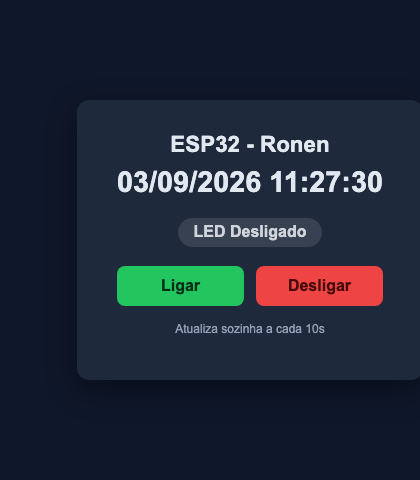

# WebServer - Acionamento Remoto

- **Autor:** Ronen Rodrigues Silva Filho
- **Instituição:** Universidade de Brasília (UnB) — Pós-graduação, PPMEC
- **Disciplina:** PPMEC0166 - Tópicos Avançados em Sistemas Mecatrônicos 3 (Princípios de Internet das Coisas)
- **Professor:** Jones Yudi Mori Alves da Silva
- **Entrega:** 12/09/2026

## Instruções

Hospedar uma página web no ESP32 que permita o acionamento do LED
remotamente.

Construído a partir do material [Internet Connections](../connect/conectividadeDeRede.pdf),
Parte 5 ("Comandos Remotos"), usado como roteiro de aprendizagem.

## Hardware

- Placa: ESP32-WROOM-32 DevKitC
- LED: onboard, GPIO2

## Configuração de rede

O SSID/senha ficam em [main/main.c](main/main.c) como placeholder
(`SEU_SSID_AQUI`/`SUA_SENHA_AQUI`) — **não são credenciais reais**, edite
antes de compilar:

```c
ESP_ERROR_CHECK(wifi_connect_sta("SEU_SSID_AQUI", "SUA_SENHA_AQUI", 20000));
```

## Implementação

- **[connect.c](main/connect.c)/[connect.h](main/connect.h)** — conexão
  Wi-Fi em modo estação (`wifi_connect_sta`), com reconexão automática em
  queda de sinal e power-save desligado (`esp_wifi_set_ps(WIFI_PS_NONE)`
  — necessário para lidar com redes mais sensíveis ao handshake WPA2,
  como o Hotspot Pessoal do iPhone).
- **[clock.c](main/clock.c)/[clock.h](main/clock.h)** — sincroniza o
  horário via NTP e serve a página principal (`GET /`): mostra data/hora
  atual, o status do LED e os botões de acionamento. A página se
  atualiza sozinha a cada 10s.
- **[toogleLed.c](main/toogleLed.c)/[toogleLed.h](main/toogleLed.h)** —
  configuram o LED como saída e implementam o handler (`POST /`) que
  liga/desliga o LED a partir de um corpo JSON, usado tanto pelos
  botões da página quanto por requisições externas.
- **[main.c](main/main.c)** — conecta ao Wi-Fi e registra as duas rotas
  no servidor HTTP.

## Resultado



*Página servida pelo ESP32, acessada por um navegador na mesma rede
(testado no Hotspot Pessoal do iPhone).*

## Testando

### Pela página web (uso normal)

1. Build, flash e monitor (comandos abaixo); anote o IP mostrado no log
   de conexão (`esp_netif_handlers: sta ip: ...`).
2. Acesse `http://<IP-do-dispositivo>/` num navegador, na mesma rede.
3. A página mostra o horário atual e o status do LED. Clique em
   **Ligar** ou **Desligar** — o LED responde na hora.

### Direto pela API (Thunder Client ou curl)

A rota usada pelos botões da página também pode ser chamada
diretamente, por exemplo pra automação ou testes:

- Método `POST`, URL = IP do dispositivo (ex. `192.168.1.100`)
- Header: `Content-Type: application/json`
- Body JSON: `{ "is_on": true }` (ou `false`)

**curl (macOS/Linux):**

```
curl -X POST http://192.168.1.100/ \
  -H "Content-Type: application/json" \
  -d '{"is_on": true}'
```

**PowerShell (Windows):**

```powershell
Invoke-RestMethod -Uri "http://192.168.1.100/" -Method Post -ContentType "application/json" -Body '{"is_on": true}'
```

**cmd.exe (Windows):**

```cmd
curl -X POST http://192.168.1.100/ -H "Content-Type: application/json" -d "{\"is_on\": true}"
```

## Build, flash e monitor

Em terminal novo, se `idf.py` não for reconhecido:

```
source ~/esp/esp-idf/export.sh
```

Depois:

```
idf.py set-target esp32
idf.py build
idf.py -p /dev/cu.usbserial-0001 flash monitor
```

Sair do monitor: `Ctrl + ]`
