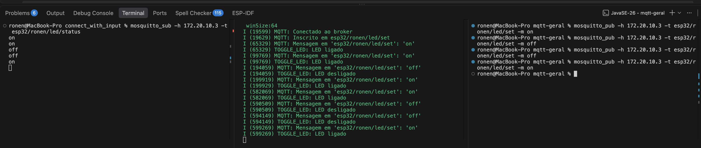

# MQTT Geral

- **Autor:** Ronen Rodrigues Silva Filho
- **Instituição:** Universidade de Brasília (UnB) — Pós-graduação, PPMEC
- **Disciplina:** PPMEC0166 - Tópicos Avançados em Sistemas Mecatrônicos 3 (Princípios de Internet das Coisas)
- **Professor:** Jones Yudi Mori Alves da Silva

Cliente MQTT no ESP32: publica o status do LED e assina um tópico de
comando pra ligar/desligar remotamente.

## Hardware

- Placa: ESP32-WROOM-32 DevKitC
- LED: onboard, GPIO2

## Configuração

Credenciais (Wi-Fi e broker MQTT) ficam num header separado que não é
versionado — equivalente a um `.env`. Antes de compilar:

```
cp main/secrets.h.example main/secrets.h
```

E edite `main/secrets.h` com seus valores reais:

```c
#define WIFI_SSID     "SEU_SSID_AQUI"
#define WIFI_PASSWORD "SUA_SENHA_AQUI"
#define MQTT_BROKER_URI "mqtt://SEU_IP_DO_BROKER:1883"
```

`MQTT_BROKER_URI` pode ser o seu Mosquitto local ou o do professor —
os dois precisam estar na mesma rede que o ESP32.

## Tópicos

Namespaced com o nome do aluno, pra não colidir com outros dispositivos
no mesmo broker compartilhado:

| Tópico | Direção | Payload |
| --- | --- | --- |
| `esp32/ronen/led/set` | ESP32 assina (recebe comando) | `on` ou `off` |
| `esp32/ronen/led/status` | ESP32 publica (retido) | `on` ou `off` |

## Implementação

- **[connect.c](main/connect.c)/[connect.h](main/connect.h)** — conexão
  Wi-Fi em modo estação (`wifi_connect_sta`), com reconexão automática
  em queda de sinal.
- **[toogleLed.c](main/toogleLed.c)/[toogleLed.h](main/toogleLed.h)** —
  controle do LED (GPIO2): inicialização e liga/desliga.
- **[mqtt_main.c](main/mqtt_main.c)/[mqtt_main.h](main/mqtt_main.h)** —
  cliente MQTT (`esp-mqtt`): ao conectar, assina `esp32/ronen/led/set` e
  publica o status atual. A cada mensagem recebida nesse tópico
  (`on`/`off`), liga/desliga o LED e republica o status (retido, QoS 1)
  em `esp32/ronen/led/status`.

## Testando

Com o Mosquitto rodando (local ou do professor) e o ESP32 conectado,
usando o `mosquitto_pub`/`mosquitto_sub` da linha de comando:

**Acompanhar o status:**

```
mosquitto_sub -h <IP-do-broker> -t esp32/ronen/led/status
```

**Ligar/desligar:**

```
mosquitto_pub -h <IP-do-broker> -t esp32/ronen/led/set -m on
mosquitto_pub -h <IP-do-broker> -t esp32/ronen/led/set -m off
```

O LED deve responder na hora, e o tópico de status deve atualizar
(visível em quem estiver com o `mosquitto_sub` aberto).

### Resultado



Três terminais abertos ao mesmo tempo, cada um com um comando diferente:

| Aba | Comando digitado | O que mostra |
| --- | --- | --- |
| Esquerda | `mosquitto_sub -h 172.20.10.3 -t esp32/ronen/led/status` | Sequência de status recebidos: `on, on, off, off, on` |
| Meio | `idf.py -p /dev/cu.usbserial-0001 monitor` | Log do ESP32: conexão ao broker, inscrição no tópico, cada mensagem MQTT recebida (`'on'`/`'off'`) e a ação correspondente (`TOGGLE_LED: LED ligado/desligado`) |
| Direita | `mosquitto_pub -h 172.20.10.3 -t esp32/ronen/led/set -m on` (e `-m off`, repetidos) | Os comandos indo e voltando, na ordem: `on, off, off, on` |

## Build, flash e monitor

Em terminal novo, se `idf.py` não for reconhecido:

```
source ~/esp/esp-idf/export.sh
```

Depois:

```
idf.py set-target esp32
idf.py build
idf.py -p /dev/cu.usbserial-0001 flash monitor
```

Sair do monitor: `Ctrl + ]`
