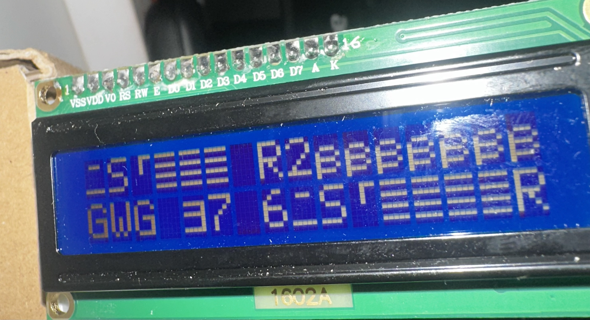
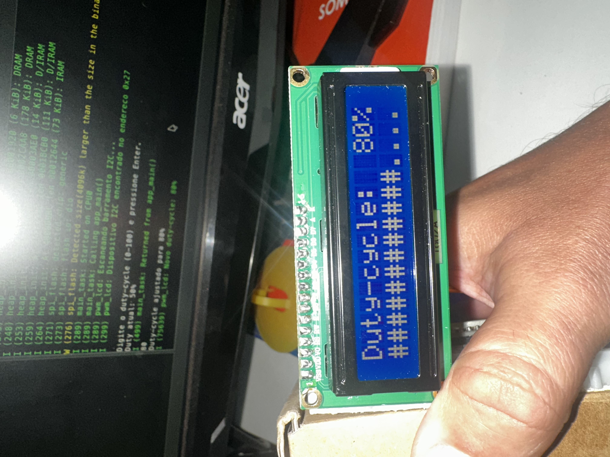
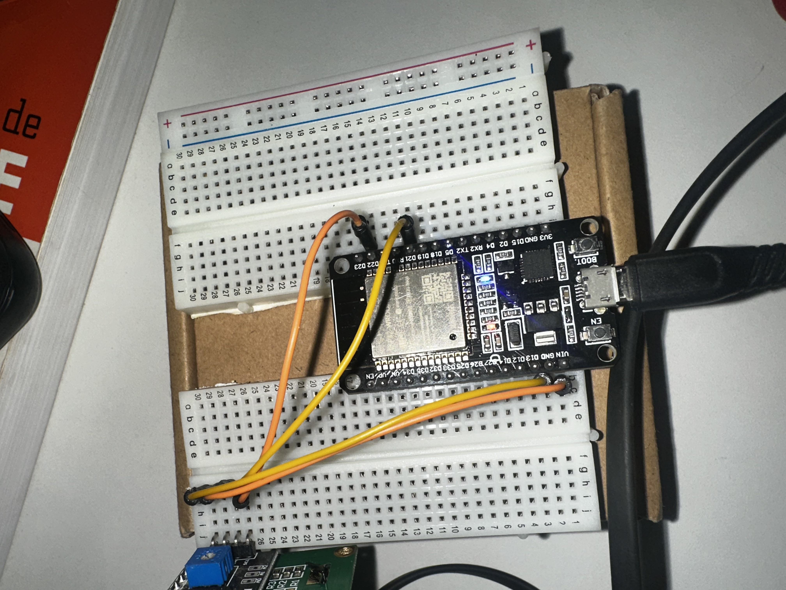

# PWM + LCD

Extensão do [pwm_software](../pwm_software): mesma lógica de PWM em
software, agora mostrando o duty-cycle num LCD 16x2 (I2C) em vez de só
pelo monitor serial.

Um LCD de caracteres não desenha uma forma de onda de verdade — o que dá
pra fazer é mostrar o valor do duty-cycle em texto e uma barra de nível
feita de caracteres (`#`/`.`), como aproximação visual.

## Hardware

- Placa: ESP32-WROOM-32 DevKitC
- LED: onboard, GPIO2
- LCD: 16x2 (HD44780) com backpack I2C (PCF8574), endereço `0x27`
  - `VCC` → `VIN` (5V)
  - `GND` → `GND`
  - `SDA` → `GPIO21`
  - `SCL` → `GPIO22`

Se o LCD não responder, o endereço alternativo mais comum é `0x3F`
(ajustar `LCD_I2C_ADDR` em
[main/pwm_lcd_main.c](main/pwm_lcd_main.c)).

## Implementação

- PWM: mesma abordagem do `pwm_software` — período fixo de 1kHz via
  `esp_timer`, sem usar o periférico LEDC.
- LCD: driver próprio e minimalista em
  [main/lcd1602.c](main/lcd1602.c)/[.h](main/lcd1602.h), bit-banging os
  comandos HD44780 em modo 4 bits através do expansor I2C PCF8574 do
  backpack. Não depende de nenhuma biblioteca externa.
- Duty-cycle via terminal serial, igual ao `pwm_software`; a cada valor
  novo, o LCD é atualizado junto.
- No boot, o `app_main` escaneia o barramento I2C e loga (`ESP_LOGI`)
  todos os endereços que responderam — útil pra confirmar o endereço real
  do módulo antes de mexer em `LCD_I2C_ADDR`.

## Troubleshooting

Testado com um backpack "MH" (chip PCF8574T genuíno, endereço `0x27`).
Sintomas observados durante o desenvolvimento e o que resolveu:

- **Backlight acende, mas nada aparece na tela:** display nunca chega a
  ser ligado internamente pelo HD44780 (fica em "display off" até o
  comando de inicialização ser recebido corretamente) — não é
  necessariamente falta de contraste.
- **Texto aparece, mas embaralhado:** sinal de integridade/tempo, comum
  em fiação de protoboard com jumpers. Ajudou: reduzir o clock do I2C
  para 50kHz (`scl_speed_hz` em `lcd1602_init`), aumentar as margens de
  tempo do pulso de Enable, e principalmente reconectar os jumpers com
  firmeza — contato frouxo em protoboard é a causa mais comum.
- Existe um `#define LCD_REVERSE_NIBBLE` em
  [main/lcd1602.c](main/lcd1602.c) para backpacks que ligam D4-D7 na
  ordem invertida. Não foi necessário neste módulo (mapeamento padrão
  RS/RW/E/Backlight/D4-D7 funcionou depois dos ajustes acima).



*Exemplo do sintoma "texto embaralhado" descrito acima — comunicação I2C
confirmada (scan encontrava o endereço `0x27`), mas caracteres
incorretos por integridade de sinal.*

## Resultado



*Funcionando: `Duty-cycle: 80%` legível na linha 1, barra de nível na
linha 2. Ao fundo, o log do monitor confirma o scan I2C (`Dispositivo
I2C encontrado no endereco 0x27`) e a leitura do duty-cycle digitado.*



*Montagem física: ESP32 e LCD (com backpack I2C) na protoboard.*

Vídeo de demonstração (duty-cycle sendo alterado em tempo real, LED e
LCD respondendo juntos): [midia/IMG_9318.mp4](midia/IMG_9318.mp4)

## Build, flash e monitor

Em terminal novo, se `idf.py` não for reconhecido:

```
source ~/esp/esp-idf/export.sh
```

Depois:

```
idf.py set-target esp32
idf.py build
idf.py -p /dev/cu.usbserial-0001 flash monitor
```

Sair do monitor: `Ctrl + ]`

Se alternar entre build pela CLI e pela Espressif-IDE/VS Code, a IDE pode
acusar conflito de instalação do ESP-IDF (a `build/` foi gerada por uma
instalação diferente da configurada na IDE). Resolve com "ESP-IDF:
Project Full Clean" (ou apagando a pasta `build/` manualmente) antes de
buildar de novo pela IDE.
