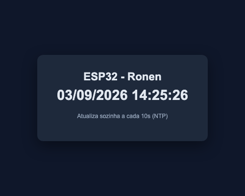

# Webserver - Relógio

- **Autor:** Ronen Rodrigues Silva Filho
- **Instituição:** Universidade de Brasília (UnB) — Pós-graduação, PPMEC
- **Disciplina:** PPMEC0166 - Tópicos Avançados em Sistemas Mecatrônicos 3 (Princípios de Internet das Coisas)
- **Professor:** Jones Yudi Mori Alves da Silva
- **Entrega:** 04/09/2026

## Instruções

Nesta tarefa, você deve unir o exemplo de NTP com o exemplo de
WebServer de modo que o microcontrolador acesse um servidor NTP na
internet e disponibilize em sua própria página o timestamp adquirido.
Faça um loop para atualização a cada 10 segundos.

## Hardware

- Placa: ESP32-WROOM-32 DevKitC

## Configuração

Credenciais de Wi-Fi ficam num header separado que não é versionado —
equivalente a um `.env`. Antes de compilar:

```
cp main/secrets.h.example main/secrets.h
```

E edite `main/secrets.h` com o SSID/senha reais:

```c
#define WIFI_SSID     "SEU_SSID_AQUI"
#define WIFI_PASSWORD "SUA_SENHA_AQUI"
```

## Implementação

- **[connect.c](main/connect.c)/[connect.h](main/connect.h)** — conexão
  Wi-Fi em modo estação (`wifi_connect_sta`), com reconexão automática
  em queda de sinal.
- **[clock.c](main/clock.c)/[clock.h](main/clock.h)** — sincroniza o
  horário via NTP (`pool.ntp.org`, fuso de Brasília) e serve a página
  principal (`GET /`) com o timestamp atual. A tag
  `<meta http-equiv="refresh" content="10">` faz a página recarregar
  sozinha a cada 10 segundos, buscando de novo o horário do ESP32 —
  que é o loop de atualização pedido no enunciado.
- **[main.c](main/main.c)** — conecta ao Wi-Fi, sincroniza o horário e
  sobe o servidor HTTP.

## Resultado



*Página servida pelo ESP32, horário sincronizado via NTP e conferido
contra o horário real no momento do teste.*

## Testando

1. Build, flash e monitor (comandos abaixo); anote o IP mostrado no log
   de conexão (`esp_netif_handlers: sta ip: ...`) e confira no log a
   linha `CLOCK: Horario sincronizado: ...`.
2. Acesse `http://<IP-do-dispositivo>/` num navegador, na mesma rede.
3. A página mostra a data/hora atual do ESP32 e recarrega sozinha a
   cada 10 segundos.

## Build, flash e monitor

Em terminal novo, se `idf.py` não for reconhecido:

```
source ~/esp/esp-idf/export.sh
```

Depois:

```
idf.py set-target esp32
idf.py build
idf.py -p /dev/cu.usbserial-0001 flash monitor
```

Sair do monitor: `Ctrl + ]`
